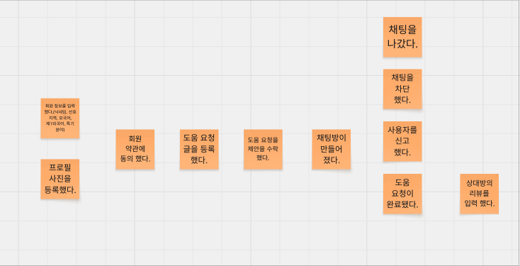
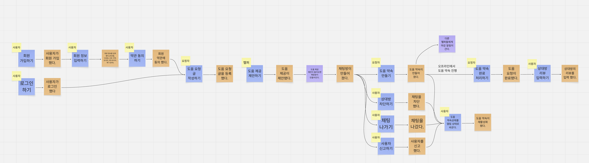
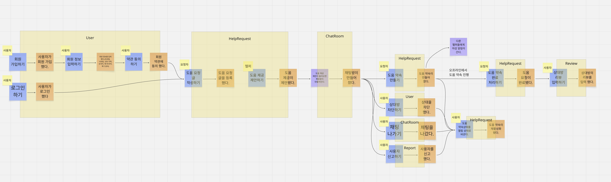
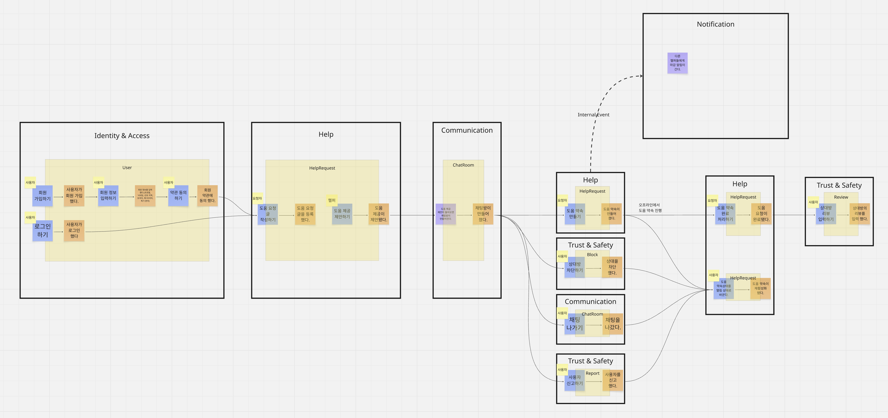

## 1. 개요

여기선 DDD를 소개하고, 이를 사용한 도메인 분석 및 설계 방법에 대해서 소개한다. DDD는 보통 모놀리스 아키텍쳐에서 MSA(MicroService Architecture)로 넘어가기 위해 많이들 사용한다. 빠른 개발 주기가 필요한 작은 프로젝트에서는 맞지 않다고 생각할 수도 있지만, MSA가 아니더라도 DDD를 사용하여 개발했을 때 충분히 장점이 많다.

지금부터 이야기 할 부분은 MSA를 하자는 이야기는 아니다. 비즈니스를 명확히 이해하고, 실수를 줄이고, 생산성을 높이기 위해 DDD를 사용한 **모듈러 모놀리스(Modular Monolith)**에 대한 이야기다.

### DDD란?

DDD란 Domain Driven Development의 줄임말로 에릭 에반스가 제시한 소프트웨어 개발 방법론이다. 비즈니스 도메인을 소프트웨어 설계의 핵심으로 두고 접근하는 방식으로, 비즈니스 전문가와 개발자가 공통 언어를 사용하여 문제의 본질을 파악하고 코드와 모델을 긴밀히 연결하는 데 목적이 있다.

**핵심 철학**

- 비즈니스와 기술의 간극을 줄이기 위해, 모델링과 구현이 일치하도록 노력한다.
- 팀 내에서 공통의 언어를 사용해 의사소통을 효율화한다.
- 시스템을 여러 Bounded Context로 나누어, 각 Context 별로 독립된 모델을 유지한다.

---

### 1.1. Pros & Cons

DDD는 아래와 같은 장단점이 있다. 이러한 단점에도 불구하고 DDD에 대해 이야기하는 것은 비즈니스 용어에 대한 혼란을 줄이고, 유연한 아키텍처를 가져갈 수 있기 때문이다. 특히 오버 엔지니어링이 되지 않도록 적절한 설계적 절충이 반드시 필요하다.

#### 장점(Pros)

**비즈니스 용어와 개발 용어의 통일**

기획자, 도메인 전문가, 개발자가 동일한 용어를 사용하여 의사소통하기 때문에 요구사항 오해로 인한 커뮤니케이션 비용과 버그가 줄어든다.

**명확한 경계와 응집도**

도메인을 여러 경계(Bounded Context)로 나누어 설계하므로 시스템 간의 결합도는 낮아지고, 응집도는 높아진다. 이는 특히 MSA를 도입하거나 전환할 때 훌륭한 기준이 된다.

**복잡성 제어 및 유지보수 향상**

비즈니스 로직이 UI 코드나 인프라에 섞이지 않고 순수한 도메인 모델에 캡슐화된다. 후에 시스템이 비대해져도 핵심 비즈니스 로직을 파악하고 수정하기 쉬워진다.

**유연한 아키텍처**

도메인 모델이 특정 기술 스택에 종속되지 않기 때문에 추후 인프라 환경이 바뀌더라도 핵심 도메인 코드는 영향을 적게 받는다.

#### 단점(Cons)

**학습 곡선이 높다**

고유의 개념과 패턴을 팀 전체가 정확히 이해하고 적용하는 데 상당한 시간과 노력이 필요하다.

**초기 개발 비용 증가**

수명이 짧은 서비스나 단순한 프로젝트에 도입하면 불필요한 계층과 인터페이스가 과도하게 늘어나 개발 속도가 느려지는 오버 엔지니어링이 될 수 있다.

**도메인 전문가 필수**

성공적으로 진행하기 위해서는 비즈니스를 잘 이해하고 있는 전문가가 필수이다.

---

## 2. 설계 과정

DDD 설계 과정은 크게 **전략적 설계(Strategic Design)**와 **전술적 설계(Tactical Design)**로 나누어진다. 여기서는 전략적 설계에 대해서만 이야기하고, 전술적 설계는 추후 이야기하는 것으로 한다.

| 구분 | 설명 |
|------|------|
| **전략적 설계(Strategic Design)** | 비즈니스의 큰 그림을 이해하고 논리적인 설계를 하는 과정. 완료하면 핵심 흐름을 파악하고 서브 도메인을 추출할 수 있다. 보통 이벤트 스토밍을 통해 진행된다. |
| **전술적 설계(Tactical Design)** | 전략적 설계의 결과물을 실제 코드로 구현하기 위한 설계 단계. 디자인 패턴과 시스템 설계가 정해진다. |

### 주의 사항

- 모든 용어는 통일된 용어를 사용할 것. 특히 개발자만 아는 단어가 아닌 비개발자를 포함한 모두가 알 수 있는 단어를 사용할 것.
- 논의가 많이 발생하는 부분은 비즈니스적으로 중요한 부분일 수 있음.
- 왼쪽에 있는 것이 시간적으로 먼저 일어난 일임.
- 가장 처음 이벤트를 도출할 때는 제외하고 시간 순서를 잘 지켜야 한다. 과거로 회귀하는 듯한 작성은 하지 않도록 하자.

---

### 2.1. 도메인 이벤트 추출

도메인에서 이미 일어난 일을 추출하고 이를 시간의 흐름에 따라 정리하는 것이다.

어떠한 행동의 결과로 발생한 사건을 추출하는 것이기 때문에 반드시 **과거 분사형(~했다, ~됐다)**을 사용한다.

이벤트는 최대한 구체적인 편이 좋으며, 예외 케이스도 잘 생각하자.

| | 예시 |
|--|------|
| ❌ | 손님 구독 정보 수정됨 |
| ✅ | 손님 구독 요금제 업그레이드 됨 |
| ✅ | 손님 구독 일시 정지됨 |

프로필 사진 업로드나 단순 정보 수정 같은 경우는 제외하는 것이 좋다. **핵심 비즈니스와 관계된 것** 위주로 정리하자.

**진행 방법**

1. 처음에는 시간 순서 상관없이 모든 이벤트를 추출한다. 일단 모든 사건을 쏟아내는 단계이다.
2. 추출이 끝나면 이벤트를 시간 순서에 맞게 정렬한다.
3. 여기서 완벽할 필요는 없다. 다음 단계들에서 디테일을 추가하면 된다.

> 이벤트는 **주황색 포스트잇**을 사용하여 표시한다.

---

### 2.2. 커맨드, 액터, 정책 추가

**커맨드(Command)**

- 액터에 의해 행해지는 행동을 의미한다.
- 주로 동사형으로 작성한다. (예: ~하기)
- **파란색 포스트잇**을 사용하며, 주로 액터(Actor)가 붙는다.
- 이벤트는 커맨드와 아래 나오는 정책의 결과로 발생한다.

**정책(Policy)**

- 어떠한 이벤트로 인해 발생하는 시스템의 반응이다. 쉽게 이야기하면 시스템이 자동으로 수행하는 부분이다.
- 주로 동사형으로 작성한다.
- **보라색 포스트잇**을 사용하며, 액터가 따로 붙지 않는다.

**액터(Actor)**

- 커맨드(Command)를 행하는 주체이다. 일반적으로 생각하는 사용자를 의미한다.
- **노란색 작은 포스트잇**을 주로 사용한다.

> 처음 이벤트 도출할 때 나온 이벤트에서 상당 부분 변경될 수 있다.

---

### 2.3. 어그리게이트(Aggregate) 매핑

위에서 추가된 커맨드와 정책으로 인해 **어떤 데이터가 수정되는지** 식별한 것이다.

- **트랜잭션 일관성을 기준으로 구분한다.** 즉 비즈니스 규칙이 유지되기 위해 무조건 함께 변경되어야 하는 데이터의 단위이다.
- **데이터 생명주기의 단위**이기도 하다. 데이터의 생성, 삭제, 수정이 같이 이루어져야 하는가의 단위이다.
- 어그리게이트가 DB 테이블 하나를 의미하는 게 아니다. 비즈니스 규칙과 데이터 일관성을 지키기 위한 **논리적인 묶음**이다.
- 후에 어그리게이트 1개당 레포지터리 1개가 생긴다.

> **조금 어두운 노란색 사각형**(포스트잇 아님)을 사용하여 표시한다.

---

### 2.4. 바운디드 컨텍스트(Bounded Context) 분리

바운디드 컨텍스트(Bounded Context)란 직역하면 **경계가 그어진 문맥**이다. 특정 도메인 모델이 적용되는 제한된 범위를 의미한다.

가장 중요한 것은 **하나의 단어가 컨텍스트에 따라 다른 의미를 가질 수 있다**는 것이다.

사용자를 예시로 들면 다음과 같다.

| 컨텍스트 | 사용자의 의미 | 중점 속성 |
|---------|------------|----------|
| 회원 | 계정(Account) | 아이디, 비밀번호, 이메일 |
| 매칭 | 요청자 / 헬퍼 | 역할, 매칭 상태 |
| 채팅 | 발신자 / 수신자 | 메시지, 채널 |

위의 예시에서 회원, 매칭, 채팅이 각각의 바운디드 컨텍스트가 된다.

- 이러한 경계를 구분함으로써 실수에 의한 **장애 전파를 막고**, 경계별로 다른 기술 스택을 쓰는 것도 가능하다.
- 사용자 개입 없이 바운디드 컨텍스트끼리의 상호작용이 필요한 경우는 점선으로 표시한다.

> **검은 사각형**을 사용하여 컨텍스트를 구분하고 이름을 붙이자.

---

DDD에서 중요한 도메인을 설계하는 전략적 설계(Strategic Design) 단계가 끝났다.

---

## 부록: 모듈러 모놀리스(Modular Monolith)

초기 개발 속도는 챙기면서 나중의 확장성을 가져가기 위한 방법이다.

**핵심 원칙**

- **컨텍스트에 따라 모듈 단위로 분리** — 패키지 단위가 아닌 Gradle이나 Maven을 이용한 모듈 단위 분리
- **내부 이벤트 적극 활용** — 가능하면 Kotlin의 `ApplicationEventPublisher`를 적극 활용
- **데이터베이스 테이블 격리** — 모놀리스이지만 테이블을 컨텍스트별로 잘 격리

**전략적 매핑 패턴 적용 (추천)**

- **ACL(Anti-Corruption Layer)**: 다른 컨텍스트의 데이터를 가져올 때 우리 도메인 모델로 변환하는 Mapper를 만들기 (컨텍스트 변경에 의한 전파 방지)
- **Supplier / Customer 패턴**: 공급자(Supplier)와 고객(Customer)을 지정하고 그 사이의 Contract(약속)을 정의하여 지킨다. API 버전 관리, 스키마 레지스트리, 소비자 주도 계약(Consumer-Driven Contracts, CDC) 등을 통해 구현 가능하다.
